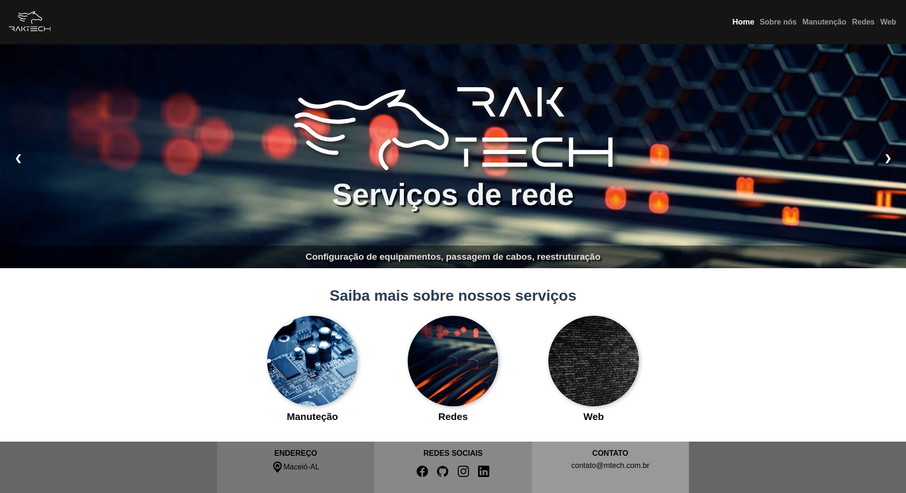
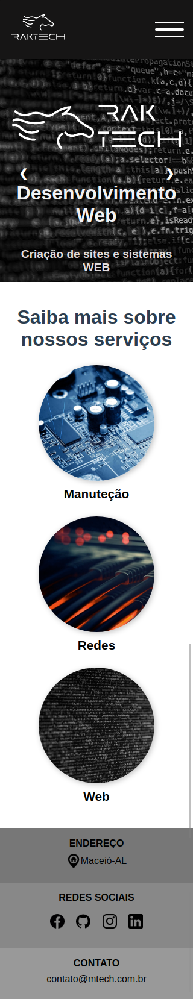

# raktech

Versão 2.0 do meu projeto "mtech".  
  
Essa versão é feita em VueJs, porém não conta com o envio de e-mail para contato.

  


## Instalação
  
Após realizar a clonagem do repositório execute o comando seguinte no terminal:

```
npm install
```

## Execução

Após a instalação das dependências execute:

```
npm run serve
```

### TODO

:white_large_square: Criar visual para tela de 'Manutenção'  
:white_large_square: Melhorar visual da tela de redes  
:white_large_square: Overlay quando o menu mobile for aberto

### Customize configuration
See [Configuration Reference](https://cli.vuejs.org/config/).
